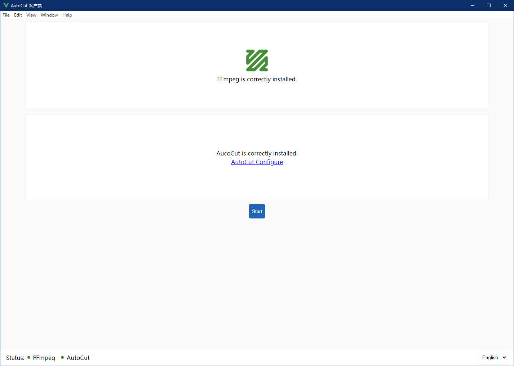
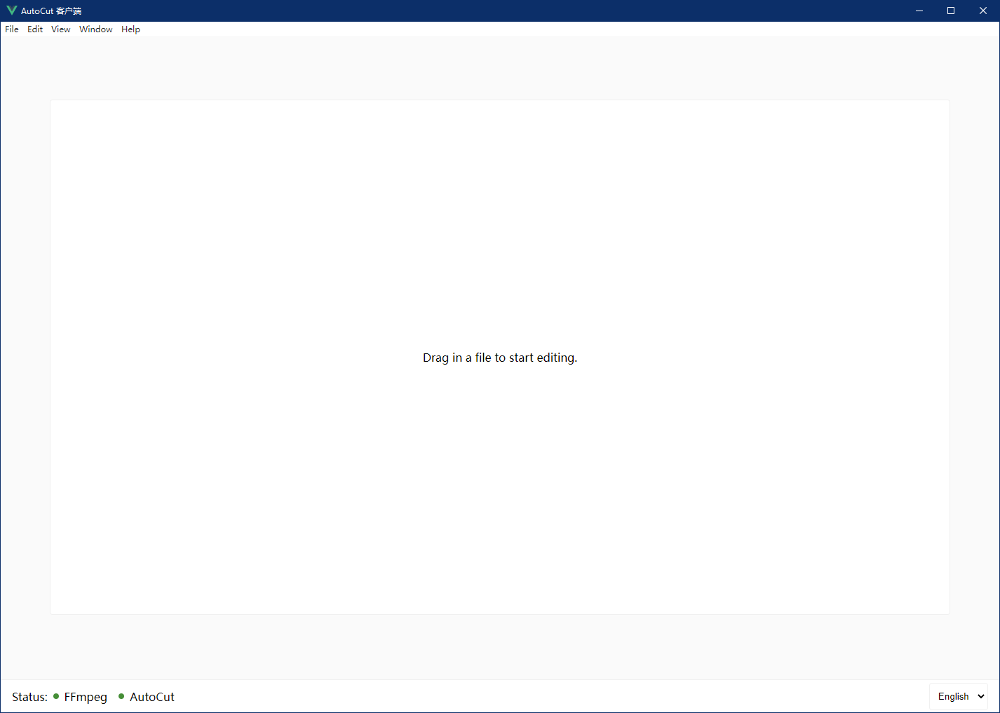
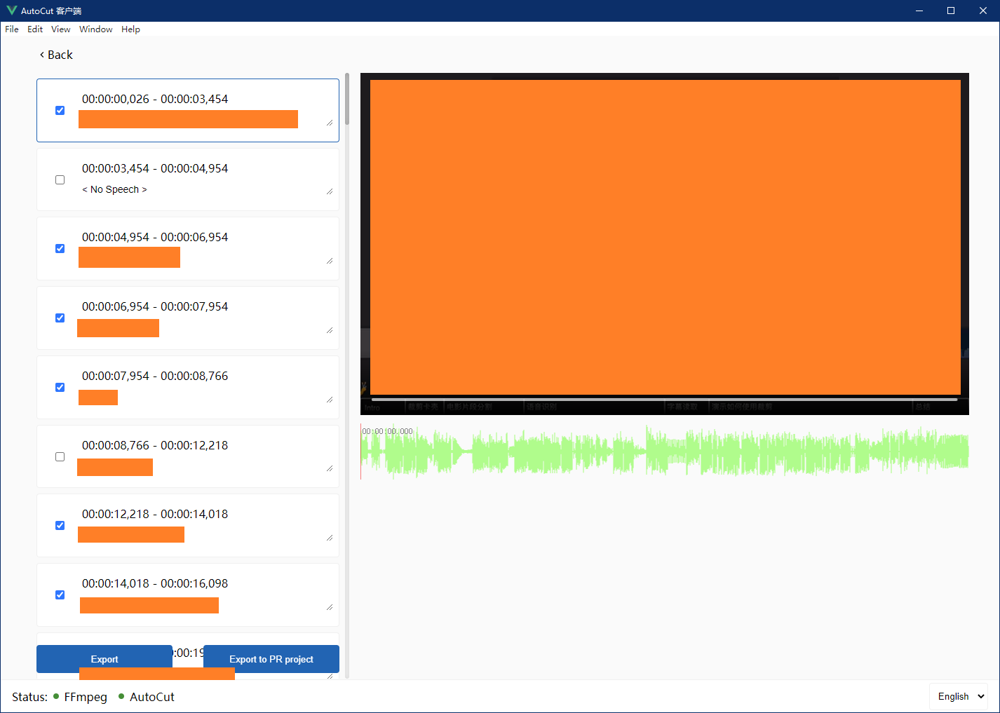
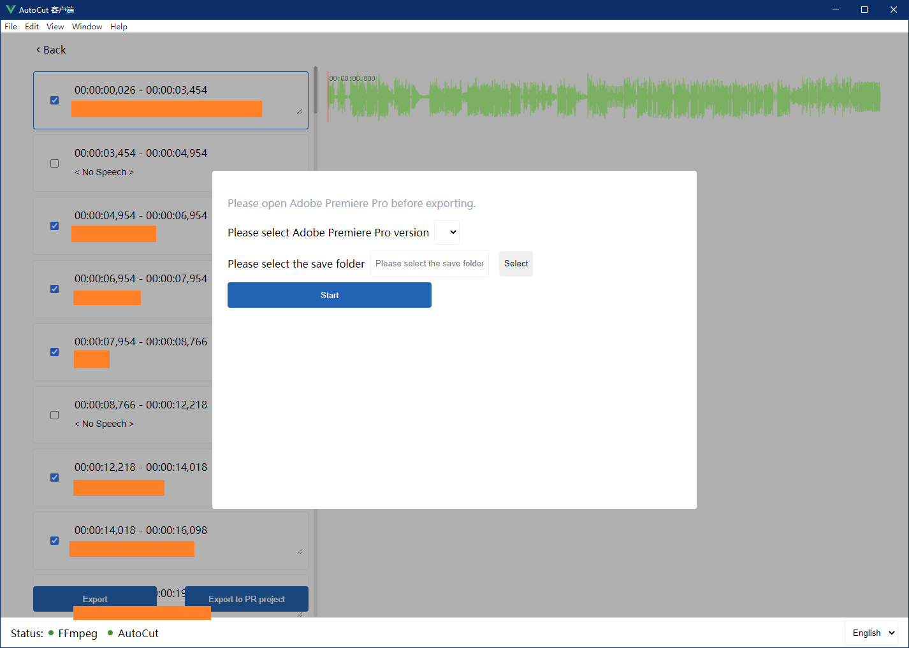

# AutoCut Client

[中文文档](README_zh.md)

This repo is an out-of-the-box client for [AutoCut](https://github.com/mli/autocut).

The project can quickly generate video subtitles and edit the video by selecting subtitle clips. The editing results can be saved directly as video, and the project supports exporting the editing results directly to Adobe Premiere Pro for easy secondary creation.

[Click to check prototype](https://js.design/f/T0LLLh?p=g8rtx09zle).

# Screenshot

# Download

[Get newest release](https://github.com/zcf0508/autocut-client/releases).

# RoadMap

- [x] Installation status
- [x] AutoCut installation guide page
- [x] Select a file and transcribe
- [x] Select subtitle clips
- [x] Generate video
- [x] Export to Adobe Premiere Pro
- [x] Edit subtitle
- [x] i18n
- [ ] Video clip preview
- [ ] Support for MacOS

# Reference

- [AutoCut](https://github.com/mli/autocut)
- [electron-vite-vue](https://github.com/electron-vite/electron-vite-vue)
